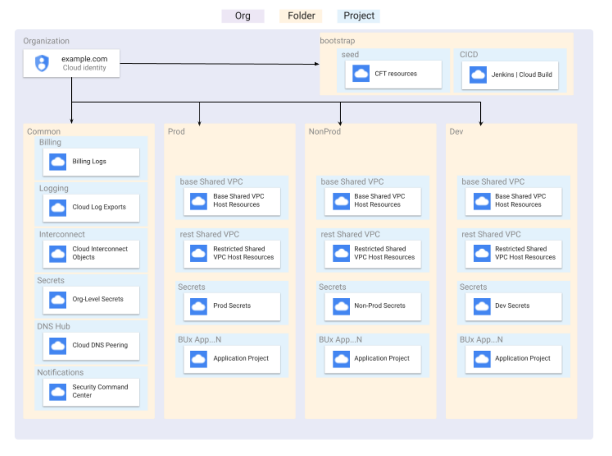

# Pedro Plassen Portfolio Project (PPPP)
## Setting up an Organization on Google Cloud

This repo is based on [terraform-example-foundation](https://github.com/terraform-google-modules/terraform-example-foundation/), and provides an automated solution to deploy and manage an Organization in Google Cloud, following the best practices defined on the [Google Cloud security foundations guide](https://services.google.com/fh/files/misc/google-cloud-security-foundations-guide.pdf).

Details about customizations can be found on the CHANGELOG.md file on each step.

The setup process can be found on the original [README.md](https://github.com/terraform-google-modules/terraform-example-foundation/blob/0ee39ceff2dce8c3a3b61d59bb1d45a4d0687e74/README.md) file.

### Overview

The organization structure follows the following proposed model

